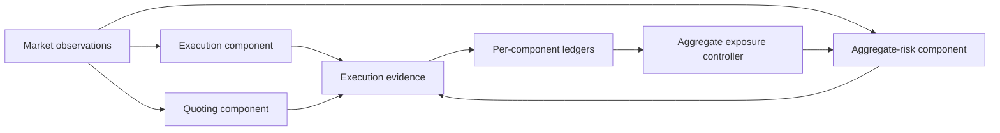

# Architecture

## System boundary

This project documents a small event-driven desk in a controlled market environment. Its three components are deliberately independent: an aggressive execution component, a passive quoting component, and an aggregate-risk component. They consume shared market observations and component-scoped lifecycle events through a message-oriented boundary.

The diagram is conceptual. It intentionally omits deployment addresses, identities, protocol literals, and market-specific configuration.

## Component responsibilities

| Component | Responsibility | Owned state | Safety boundary |
|---|---|---|---|
| Aggressive execution | Acts on a bounded signal using immediate-or-cancel style execution. | Signal history, owned position, cash, outstanding intent. | Does not treat an acknowledgement as a fill; stops on ambiguity. |
| Passive quoting | Maintains small, inventory-aware two-sided liquidity. | Per-side lifecycle state, inventory, cash, latest valid market view. | Cancels on stale or one-sided data; waits for terminal evidence before replacement. |
| Aggregate risk | Reconstructs component and desk exposure from confirmed events and reduces excess. | Per-component/per-instrument ledger, aggregate exposure, dedupe identities, hedge state. | Allows one unresolved hedge; requires a fresh valid market view after exposure changes. |

## Financial state model

Every ledger is signed and execution-driven:

- a buy increases position and reduces cash;
- a sell decreases position and increases cash; and
- diagnostic mark-to-mid is `cash + position × midpoint`.

Mark-to-mid is not realised profit and must never be used as a standalone promotion criterion. An acknowledgement can report acceptance or immediate quantity, but confirmed execution evidence remains the financial source of truth.

## Lifecycle and concurrency model

A request can be accepted, rejected, resting, partially executed, fully executed, cancelled, or uncertain. These are not interchangeable states. The design therefore follows four rules:

1. register local intent before sending a request;
2. process replies and asynchronous lifecycle events independently;
3. replace an order only after terminal lifecycle evidence, not merely a cancellation acknowledgement; and
4. serialize state transitions so callbacks and replies cannot create conflicting financial updates.

True repeated notifications are idempotently suppressed using event identity. Distinct component-owned legs of the same economic interaction are retained because each can carry a real component-accounting change.

## Risk invariants

- New passive risk requires fresh, two-sided market information.
- A stale view, disconnect, timeout, or contradictory event fails closed.
- Inventory-worsening quoting is suppressed at its configured limit.
- An unresolved hedge blocks additional hedging for that instrument.
- A risk-reducing action uses observed execution quantity; no position is invented from a request reply.
- Shutdown stops new additions before bounded cancellation and cleanup.

## Explicit limitations

The documented system is a bounded, single-instrument research implementation. It does not claim durable recovery across process loss, universal protocol coverage, post-only execution protection, or profitability. Those constraints are part of the architecture: uncertain recovery paths fail closed rather than pretending to restore unverified state.

The public core deliberately keeps integration policy outside the model:

- `Bbo` represents a complete two-sided view; adapters represent missing or
  one-sided markets by withholding the optional view supplied to `QuoteEngine`.
- `DeskPositionBook.apply` processes one typed execution at a time. An adapter
  that can receive both component-owned legs of one interaction must serialize
  or batch those legs before asking the hedge controller to reevaluate.
- `ExecutionDeduplicator` uses an unbounded in-memory set in this educational
  core. A connected system must add an explicit capacity policy and fail closed
  rather than silently evicting identities.
